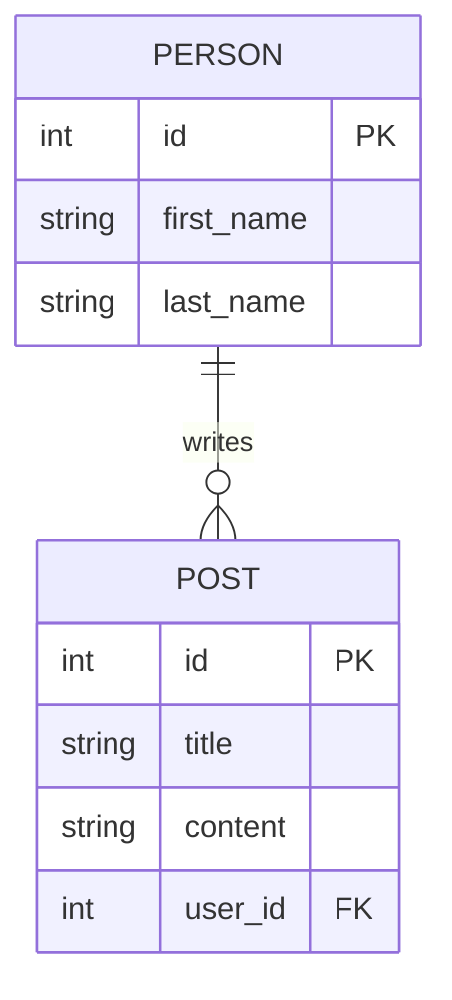

# CRUD API для управления данными пользователей и постов

Проект представляет собой RESTful API сервис, разработанный для демонстрации навыков проектирования баз данных и построения серверной архитектуры на Node.js.

## 🎯 Цель проекта
Реализация надежного бэкенд-решения для системы управления контентом, поддерживающего связи между сущностями и обеспечивающего целостность данных.

## 🛠 Технологический стек
* **Runtime:** Node.js
* **Framework:** Express.js
* **Database:** PostgreSQL (Relational)
* **Инструменты:** pg-library, Postman (тестирование API)

## 📊 Архитектура данных
В основе проекта лежит реляционная модель. Спроектирована связь **"Один ко многим" (One-to-Many)** между пользователями и их публикациями.

### Сущности и атрибуты:
* **User (Пользователь):** ID, Имя, Фамилия.
* **Post (Пост):** ID, Заголовок, Контент, User_ID (FK).

## 🚀 Функциональные возможности (API Endpoints)

### Пользователи (Users)
- `POST /api/user` — Создание нового пользователя
- `GET /api/user` — Получение списка всех пользователей
- `GET /api/user/:id` — Получение детальной информации о пользователе
- `PUT /api/user` — Обновление данных пользователя
- `DELETE /api/user/:id` — Удаление пользователя

### Посты (Posts)
- `POST /api/post` — Создание поста (с привязкой к `user_id`)
- `GET /api/post?id=...` — Получение постов конкретного пользователя

## ⚙️ Установка и запуск
1. Склонируйте репозиторий.
2. Создайте базу данных PostgreSQL.
3. Выполните SQL-скрипт из файла `database.sql` для создания структуры таблиц.
4. Настройте подключение в `db.js`.
5. Запустите сервер: `npm run dev`.

